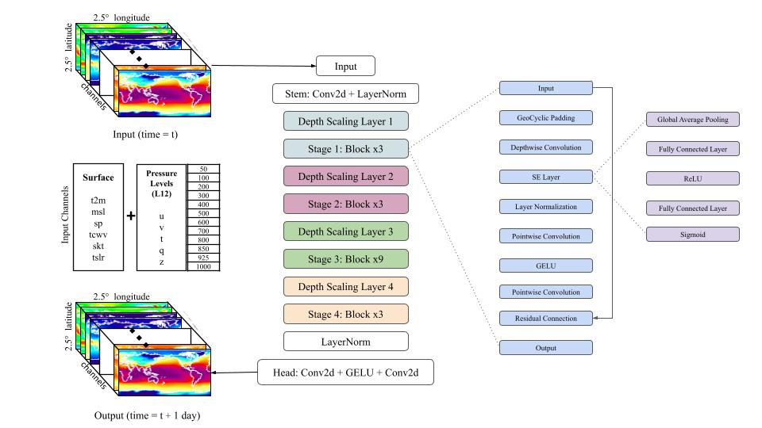
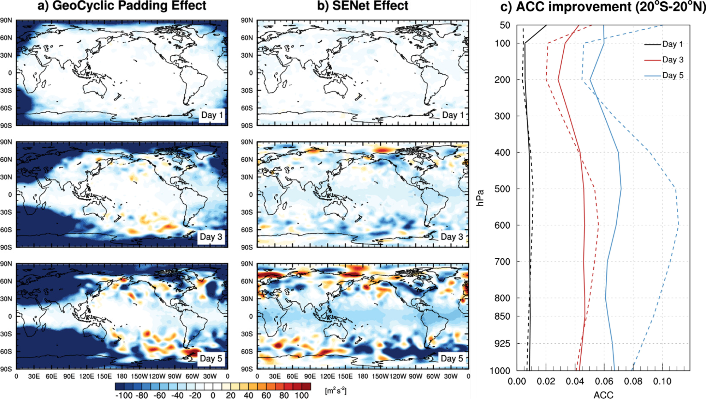

# KARINA
This repository contains the code used for 
"KARINA: An Efficient Deep Learning Model For Global Weather Forecast"

KARINA is a global data-driven weather forecasting model that achieves forecasting accuracy comparable to higher-resolution counterparts with significantly less computational resources, requiring only 4 NVIDIA A100 GPUs and less than 12 hours of training. KARINA combines ConvNext, SENet, and Geocyclic Padding to enhance weather forecasting at a 2.5° resolution, which could filter out high-frequency noise. Geocyclic Padding preserves pixels at the lateral boundary of the input image, thereby maintaining atmospheric flow continuity in the spherical Earth. SENet dynamically improves feature response, advancing atmospheric process modeling, particularly in the vertical column process as numerous channels. In this vein, KARINA sets new benchmarks in weather forecasting accuracy, surpassing existing models like the ECMWF S2S reforecasts at a lead time of up to 7 days. Remarkably, KARINA achieved competitive performance even when compared to the recently developed models (Pangu-Weather, GraphCast, ClimaX, and FourCastNet) trained with high-resolution data having 100 times larger pixels. Conclusively, KARINA significantly advances global weather forecasting by efficiently modeling Earth's atmosphere with improved accuracy and resource efficiency.
[Read more about KARINA here.](https://arxiv.org/abs/2403.10555)





## Configuration Details

Below are the configuration details used in the KARINA model. Adjust the paths and parameters as necessary to match your environment and data setup:

```yaml
default: &FULL_FIELD
  orography: !!bool False
  orography_path: None # provide path to orography.nc (NetCDF) file if set to true,
  exp_dir:             # directory path to store training checkpoints and other output
  train_data_path:     # full path to /train/, files should be formatted as .nc (NetCDF)
  valid_data_path:     # full path to /test/, files should be formatted as .nc (NetCDF)
  time_means_path:     # full path to time_means.npy
  global_means_path:   # full path to global_means.npy
  global_stds_path:    # full path to global_stds.npy
```


## Acknowledgments
We express our deepest gratitude to the NVIDIA FourCastNet team for their pioneering work and generous sharing of code regarding data processing and overall training. Their contributions have been invaluable to the advancement of our project. For more information on FourCastNet, please visit their GitHub page: [NVIDIA FourCastNet.](https://github.com/NVlabs/FourCastNet)

## Citation
```bibtex
@article{cheon2024karina,
  title={KARINA: An Efficient Deep Learning Model for Global Weather Forecast},
  author={Cheon, Minjong and Choi, Yo-Hwan and Kang, Seon-Yu and Choi, Yumi and Lee, Jeong-Gil and Kang, Daehyun},
  journal={arXiv preprint arXiv:2403.10555},
  year={2024}
}
